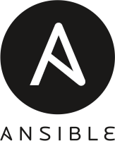

# NIC.br Ansible

Este repositório guarda os arquivos para o laboratório de Ansible da palestra da NIC.br de 2022.

Para fazer o laboratório é preciso possuir um software de virtualização, conhecido como hypervisor, como por exemplo o [VirtualBox](https://www.virtualbox.org/). Para atender ao maior número de pessoas possíveis, todas as ferramentas utilizadas e recomendadas neste laboratório são livres e de código aberto.

Existem outros hypervisors como o [KVM](https://www.linux-kvm.org/page/Main_Page) para Linux ou outras soluções fechadas para Windows ou sistemas operacionais da Apple, porém o foco será sempre o VirtualBox.

Para criar o laboratório é possível utilizar o `Vagrant` ou baixar o arquivo [ansible.ova](https://drive.google.com/file/d/1DfS5piCj1AX0k8O3Njoax5BNQ6dA2GX_/view?usp=sharing) e importá-lo no VirtualBox, a primeira forma é mais moderna e trás mais possibilidades de estudo para o usuário.

Escolha uma das opções abaixo para obter melhores instruções sobre como preparar o ambiente:

- [Vangrat](https://github.com/hector-vido/nicbr-ansible/tree/master/steps/vagrant.md)
- [ansible.ova](https://github.com/hector-vido/nicbr-ansible/tree/master/steps/ova.md)

**Atenção:**
- Será preciso habilitar a capacidade de virtualização do seu processador na "BIOS" do seu computador.
- O Vagrant tem maior compatibilidade com o `VirtualBox` e o `Libvirt`, nem todas as imagens estão disponíveis para todos os hypervisors.
- O funcionamento do `HyperV` com o Vagrant é parcial, as máquinas não conseguem ser configuradas com endereço IP fixo.
- O `HyperV` ou mesmo versões não originais do `VMWare Workstation` podem causar problemas nada óbvios no `VirtualBox`, não use software pirata, use Linux.
- Algums versões do Windows possuem componentes do `HyperV` instalados que podem causar problemas no `VirtualBox`.
- Até o momento não há hypervisors livres de arquitetura `amd64`(`x86_64`) para sistemas operacionais da Apple `arm64`, se possui uma máquina destas, venda, compre um computador de verdade e ajude alguém com o dinheiro que sobrar.
- O Fedora 36 está com problemas para configurar endereço IP fixo.

# Ansible



De forma simplista, Ansible é uma ferramenta de automação, mas é importante entender de qual tipo automação estamos falando e que "Ansible" não é apenas uma única ferramenta.

Ansible é um projeto livre e de código aberto voltado para o provisionamento, gerência de configuração e implantação de software que nos possibilita utilizar [Infraestrutura como Código](https://pt.wikipedia.org/wiki/Infraestrutura_como_C%C3%B3digo). Foi desenvolvido originalmente por Michael DeHaan e adquirido pela Red Hat em 2015.

Na maioria das vezes as operações do Ansible acontecem através de uma máquina central, normalmente a mesma que está usando para ler este texto, se comunicando com outros dispositivos, APIs ou qualquer outro protocolo disponível. Essa máquina é conhecida como **control node**.

Na grande maioria das vezes utilizamos o Ansible para configurar outras máquinas, os **managed nodes**, e fazemos isso através de [**módulos**](https://docs.ansible.com/ansible/2.9/modules/list_of_all_modules.html). Para cada tarefa que deseja fazer (instalar um pacote, criar um usuário, copiar um arquivo), haverá um módulo especifico. Durante a execução, o Ansible se conectará ao nó gerenciado, copiando o módulo (normalmente código python) e o executando.

Para fazer a conexões em outras máquinas o Ansible utiliza o bom e velho [**SSH**](https://pt.wikipedia.org/wiki/Secure_Shell) em máquinas Linux ou o [**winrm**](https://en.wikipedia.org/wiki/Windows_Remote_Management) em máquinas Windows, formas de conexão já conhecidas pelos profissionais de cada um destes sistemas.

Apesar de configurar máquinas ser a principal função do Ansible, esta não é a sua única capacidade. Podemos utilizar o Ansible para consumir APIs, configurar equipamentos de rede (switches, pontos de acesso, etc), fazer testes (verificar se uma porta está aberta, procurar uma palavra em um site) e praticamente tudo o que sua criatividade e persistência lhe permitir. 

Para **codificarmos nossa infraestrutura** em Ansible utilizamos um arquivo de texto bastante fácil de se ler e escrever chamado **playbook**. Uma playbook descreve as tarefas que queremos executar e são escritas no formato de serialização [YAML](https://pt.wikipedia.org/wiki/YAML). 

Para informar ao Ansible quais nós queremos gerenciar utilizamos um **inventário**. Basicamente um inventário é um arquivo de texto simples com informações pertinentes de cada nó. É muito comum utilizarmos o formato `.ini` já conhecido no Linux, mas podemos escrevê-los em outros formatos como `.json` ou `.yaml`.

Existem duas características interessantes do Ansible, a sua forma declarativa e a sua idempotência.

## Forma Declarativa

Uma das características do Ansible é trabalhar de forma declarativa, nós não especificamos como as coisas devem ser feitas e sim como as coisas devem ficar.

Por exemplo, para instalar o `vim` nós não digitamos o comando de instalação de forma imperativa:

```bash
dnf install -y vim
```

Muito pelo contrário, nós especificamos o pacote e seu estado e o Ansible ficará responsável por resolver:

```yml
package:
  name: vim
  state: present
```

Dessa forma eu não preciso me preocupar tanto com parâmetros e características peculiares de uma determinada distribuição. Nem sempre é possível trabalhar assim, mas é interessante ter esse conceito em mente.

## Idempotência

Idempotência, em ciência da computação, é a propriedade que algumas operações tem de poderem ser executadas diversas vezes sem que o resultado final se altere após a primeira execução. Neste nosso caso, significa que podemos executar um "código do Ansible" para, por exemplo, criar um usuário sem se preocupar se suas execuções subsequentes apresentarão problemas com o usuário agora existente.

No Linux, se tentarmos cadastrar o mesmo usuário duas vezes, teremos um erro na segunda execução, pois o usuário já existe.

# E o Ansible da Red Hat?

O Ansible que a Red Hat fornece aos seus clientes é baseado na versão community do Ansible, é praticamente o mesmo, porém seus módulos e demais complementos que podemos adicionar passam por um teste ainda mais rigoroso e passam a ser suportados pela própria Red Hat.

Se você quer conhecer as ferramentas da Red Hat, é um desenvolvedor, ou apenas um curioso, e não pretende necessariamente adquirir a subscrição é possível ingressar gratuitamente no [Red Hat Developer Program](https://developers.redhat.com/about) e ter acesso a todas essas ferramentas, inclusive para usar em produção.

